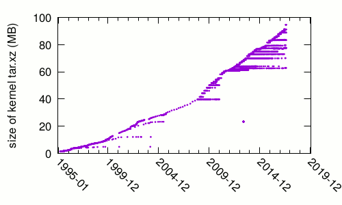

<!-- .slide: class="intro" -->

# Paketering, leverans och uppföljning
## TDD
###### david.andersson@zocom.se

Note: tryck S för att öppna speaker view

---

## Idag

* Vad är TDD?
* Varför ska man skriva tester?
* Introduktion till enhetstester i Vue
* Konfigurera och köra tester


---


*Velocity* är hur snabbt teamet kan lägga till ny funktionalitet.

Ju längre man kommer i ett projekt, desto mer komplicerat blir det. Man lägger mer och mer tid på att fixa buggar. Det blir svårare att lägga till ny funktionalitet, för att koden är så rörig.

Detta vill TDD ändra på.


---
## Linux kernel size
Storleken på källkoden för operativsystemet Linux, från 1995 till 2019


---

## TDD

TDD == Test-Driven Development (testdriven utveckling)

TDD kommer från eXtreme Programming, 1999. Det går ut på att skriva funktioner som testar koden innan man skrivit den.

I stället för att manuellt testa att ett program fungerar korrekt skriver man testfall - *test cases*. Moderna ramverk låter oss köra alla testfall automatiskt.

**"Red, green refactor"** är en minnesregel som sammanfattar hur man skriver enhetstest enligt TDD.
+ Red - skriv ett test som failar, ett "rött" test
+ Green - skriv minsta möjliga kod som får testet att lyckas, bli "grönt"
+ Refactor - förbättra koden

---

---

## Hur gör man?

1. Börja med **specifikationen**. Diskutera inom teamet vad appen ska kunna. Det kan hända att kunden ger en kravspec, men man måste ändå diskutera den inom teamet, så att alla är överens om vad som ska göras.
2. När man har en hyfsad bild över vilka krav som finns på appen, så skriver man ner dem som **kort i Trello**. (gärna som user stories)
3. Sedan tar man ett kort och **börjar skriva testfall**. Testfallen ska svara på frågan: *uppfyller koden kraven?* Nu är det ok att skriva testfallens kod.
4. Allra sist skriver man **implementationen**, så att testfallet kan bli grönt.
---

## Case study: boka tvättid (1/2)

Vi vill bygga en app som vi kan använda för att boka tvättid.
Ett utkast till specifikation:
1. man ska kunna logga in, så att systemet vet vilken användare man är
2. systemet ska visa vilka tider som är lediga
3. inloggad användare ska kunna boka ett tvättpass
4. användare kan inte boka fler än ett tvättpass
5. ett tvättpass börjar kl 9, 13, 17 och håller på i exakt 4 timmar
6. inloggad användare kan avboka sitt tvättpass

Har vi fått med allt?

---

## Case study: boka tvättid (2/2)

Testfall:
+ it should log in user with correct apartment number
+ it should display all the free time slots
+ it should not book a time slot if start time is incorrect
+ it should not book a time slot if time slot is occupied
+ it should not book a time slot if at least one other booking exist
+ it should book a time slot if start time is correct, time slot is free and no previous booking exist
+ a booked time slot should be exactly four hours long
+ osv...

---
## Exempel, pseudo-kod
```js[1-4|6|7|8-9|10-11]
function bookTimeSlot(startTime) {
    // implementation goes here
    // let's assume it should return TRUE if booking is successful
}

let badStartTime = '10:00';   // only 9, 13, 17 allowed
let result = bookTimeSlot(badStartTime);
if( result )
    console.log('test FAILED (booked bad start time)');
else
    console.log('test SUCCESSFUL (did not allow bad booking)');
```
---
## Vue, exempel komponent

```js[1-11|2-7|4,9|5,10]
export default {
    data() {
        return {
            value: 1,
            message: 'Hello'
        }
    },
    methods: {
        increase() { this.value += 1; },
        setMessage(msg) { this.message = msg; }
    }
}
```

---

## Testning i Vue
